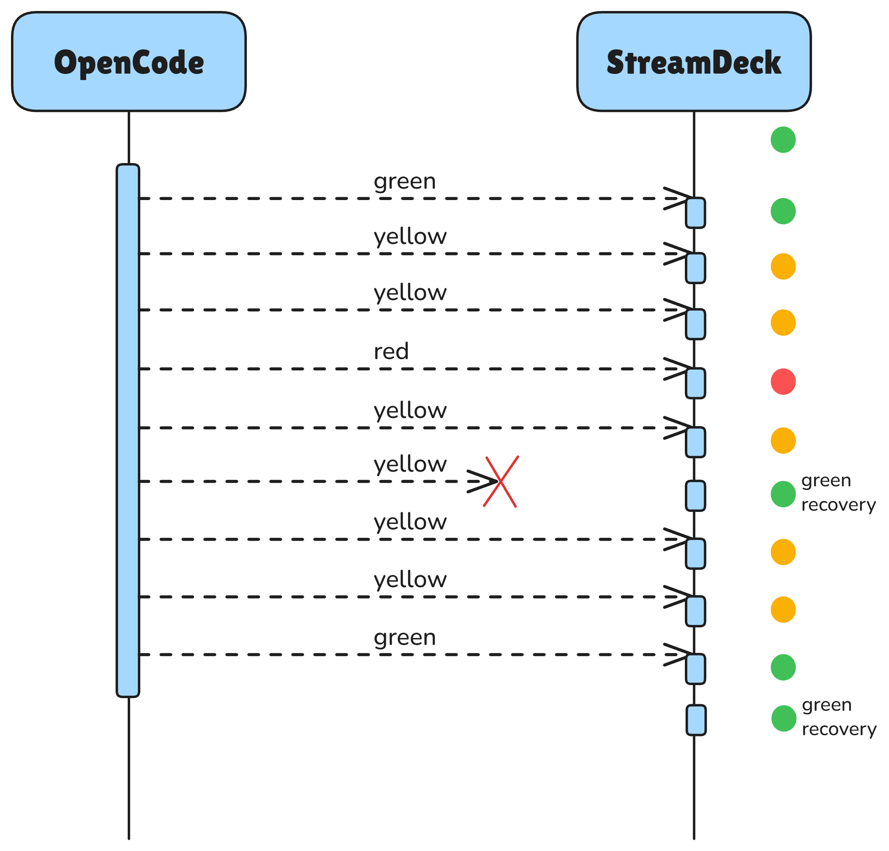
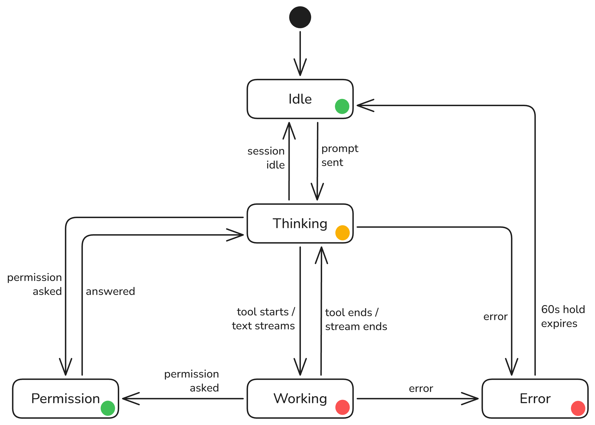

# Architecture

`opencode-streamdeck-traffic-lights` has two independently running halves joined by a small loopback HTTP protocol:

- The OpenCode plugin observes session events, derives one colour per session, reduces those colours across sessions, and sends state for its instance.
- The Stream Deck plugin owns the HTTP server, tracks liveness and state per instance, and paints the visible keys.

The OpenCode plugin sends `POST http://127.0.0.1:8765/state` roughly every two seconds, even when the state has not changed. It also sends immediately after a state event. This makes a newly started Stream Deck process converge without waiting for a transition.



## Components

```text
OpenCode
  opencode/src/plugin/index.ts
    entry point loaded by OpenCode
  opencode/src/plugin/streamdeck-status.ts
    event handling, timers, state reduction, and dispose
  opencode/src/plugin/state.ts
    pure session -> colour derivation
  opencode/src/plugin/transport.ts
    POST client, deadline, backoff, and in-flight handling

shared/contract.ts
  shared wire types, constants, validation, and address resolution

Stream Deck
  streamdeck/src/plugin.ts
    loopback HTTP state server and liveness sweeper
  streamdeck/src/actions/opencode-status.ts
    action and key settings
  streamdeck/src/actions/paint-chain.ts
    serialised per-instance repaint and dedupe
```

There is no shared process. `shared/contract.ts` is the single source of truth for the interface and is consumed as raw TypeScript by Bun and bundled by Rollup.

## Wire contract

The client sends JSON to the Stream Deck plugin:

```http
POST http://127.0.0.1:8765/state
Content-Type: application/json
```

```json
{ "instance": 1, "state": "green", "ts": 1735689600000, "seq": 42 }
```

| Field | Type | Meaning |
| --- | --- | --- |
| `instance` | non-negative integer | Logical agent/Stream Deck instance. |
| `state` | `"green" \| "yellow" \| "red"` | Colour to paint. |
| `ts` | number | Client wall-clock time in milliseconds; diagnostic only. |
| `seq` | number | Strictly increasing per client; ordering/diagnostic information only. |

The server accepts only `POST /state`. Other routes or methods return `404`. The JSON content type is required (`415` otherwise), malformed bodies return `400`, and bodies over 4096 bytes return `413`. A successful response is shaped like:

```json
{ "ok": true, "state": "green", "changed": true }
```

`changed` is `false` when the instance was already in that state and no repaint was needed. The client uses a 1500 ms `AbortSignal.timeout` for its POST. That is a client deadline, not a server timeout: the server has no request timeout and repaints visible keys before answering. The deadline is shorter than the 2 s heartbeat interval so a slow response cannot consume the next beat, while leaving time for `getSettings` and `setImage` work.

An abort caused by this deadline is treated as client-side latency and does not advance the backoff ladder. A genuine transport failure does. The tests assert both this distinction and the deadline/heartbeat relationship.

### Liveness and ordering

Liveness is based on the Stream Deck server's own arrival clock, never on `ts`. A client with an incorrect wall clock cannot appear fresh forever. `seq` is not used for deduplication or ordering decisions by the server; it is carried for ordering and diagnostics. The OpenCode side deliberately has no client deduplication: unchanged heartbeats are needed for resync and liveness.

## State derivation and priority

For each session, the OpenCode side derives a colour from the session's current activity. The priority is:

1. **Red** when a tool is running, text is actively being written, or the session has errored.
2. **Yellow** when the session is busy but has no running tool and no currently active text output: the model is thinking.
3. **Green** when the session is at rest, including while a permission prompt is waiting for the user.

Text activity remains red only for `ACTIVITY_TTL_MS` (5 seconds) after its last update. A quiet, still-busy session then becomes yellow. A running tool has no TTL: tools such as `sleep 60` can emit no events while running, so red is retained for the entire call.

An error is red and is not cleared merely by `session.idle`. Failures are often followed immediately by idle, and clearing on that event would hide the failure. Error state is cleared by a tool part entering `pending`, `running`, or `completed`, or by its one-minute `ERROR_TTL_MS` safety expiry. A permission prompt is different: it remains pending across `session.idle`, and is cleared by `permission.replied`, a `permission.ask` that resolves without asking, `session.deleted`, or its five-minute safety TTL.

Across sessions, the instance colour is the most severe colour present: `green < yellow < red`. Thus one running tool makes the instance red even if other sessions are idle. Each instance's result is sent independently by the OpenCode client.



## Recovery behaviour

- **Stream Deck restart:** the server loses its in-memory state. The next unchanged heartbeat restores the visible state in about one heartbeat (about 2 s), unless the client is already backing off; then the next attempt can be up to 15 s away.
- **Stream Deck unavailable:** failed POSTs use exponential backoff from 250 ms to a 15 s cap. The client recovers when the deck returns; no OpenCode restart is required.
- **OpenCode crash or kill:** no `dispose` runs and no final green is sent. After three missed beats (6 s), the Stream Deck side repaints the instance green. From the last beat, the total is about 7 s.
- **Clean OpenCode exit:** `dispose` stops the interval and transport, drains an in-flight beat so an already-sent red is written first, then flushes green, within a 300 ms bound. Draining matters because TCP provides no ordering guarantee across separate connections.
- **Port conflict:** if port 8765 is already in use, the Stream Deck plugin deliberately exits so the Stream Deck app exposes the crash instead of leaving a deaf process with a misleading green key.

## Instance handling

The OpenCode side reads `OPENCODE_STREAMDECK_INSTANCE` and defaults to `1`. Each Stream Deck key has an **Instance** property, also defaulting to `1`; the values must match. The Stream Deck side tracks up to 32 instances..

A mismatch is not silently repaired: the Stream Deck plugin warns when no visible key is configured for the received instance (`No visible key is configured for instance N`).

## Development escape hatch

`OPENCODE_SD_HOST` and `OPENCODE_SD_PORT` override the address on both sides using identical resolution logic in `shared/contract.ts`. They are intended for local debugging, not user configuration. The Stream Deck manifest has no environment-variable field, and the Stream Deck app does not reliably pass an environment to the plugin; the host side only inherits what the login shell exported. The OpenCode process does receive a normal environment, so `OPENCODE_SD_PORT` is reliable there only if the Stream Deck side is moved to the same port.

## Security boundary

The server binds to `127.0.0.1` only. The protocol is intentionally loopback-only and is not reachable from the network. It is not an authenticated remote API; moving the host away from loopback should therefore remain a deliberate development-only change.
