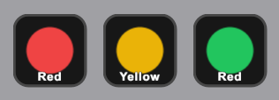
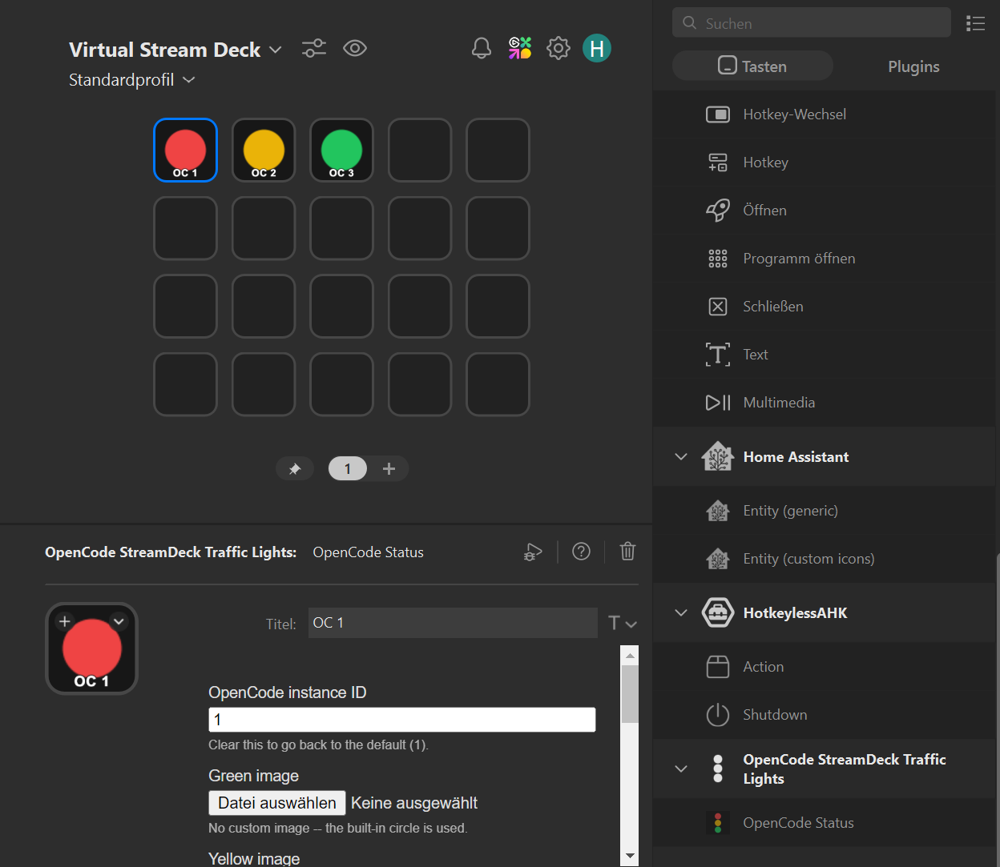
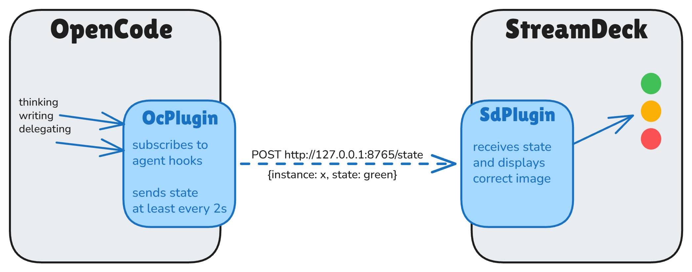

# OpenCode StreamDeck Traffic Lights

[](https://www.npmjs.com/package/@tim0_12432/opencode-streamdeck-traffic-lights-opencode)
[](https://github.com/tim0-12432/opencode-streamdeck-traffic-lights/releases)
[](https://opencode.ai)
[](https://www.elgato.com/stream-deck)
[](https://pnpm.io)
[](LICENSE)

See your OpenCode agent's status on a Stream Deck key, so you know from across the room whether it needs you.


## What the colours mean

| | State | Meaning |
| --- | --- | --- |
| 🟢 | **Green** | At rest: idle, or waiting for you to answer a permission prompt. |
| 🟡 | **Yellow** | Thinking: busy, but no tool is running and no text is being written. |
| 🔴 | **Red** | Working: a tool is running or text is streaming. Also shown for **1 minute after an error**. |



If several sessions run in one OpenCode process, the key shows the most urgent one.

## Quick start

**1. Install the Stream Deck plugin.**
Download the `.streamDeckPlugin` file from the [latest release](https://github.com/tim0-12432/opencode-streamdeck-traffic-lights/releases/latest) and double-click it.

**2. Add a key.**
Drag the **OpenCode Status** action onto any key in the Stream Deck app.



**3. Enable the OpenCode plugin.**
Add it to `~/.config/opencode/opencode.json`, or to a project-level config:

```json
{
  "$schema": "https://opencode.ai/config.json",
  "plugin": ["@tim0-12432/opencode-streamdeck-traffic-lights-opencode"]
}
```

Start OpenCode. The key should turn green.

## Multiple agents

Each key watches one **instance** number, which defaults to `1`. To track several agents, give each OpenCode process its own number:

```sh
OPENCODE_STREAMDECK_INSTANCE=2 opencode
```

Then set the same number in the key's **Instance** field. Up to 32 instances are supported.

## Requirements

- OpenCode with plugin support (tested with 1.18.32)
- Stream Deck app 7.1 or newer
- Windows 10+ or macOS 12+

## Troubleshooting

**The key never lights up.**
Usually the instance numbers don't match. Check that `OPENCODE_STREAMDECK_INSTANCE` equals the key's **Instance** setting. To confirm that OpenCode loaded the plugin, look in its log for:

```
[opencode-streamdeck-traffic-lights] traffic light active -> http://127.0.0.1:8765/state as instance 1
```

**The key is stuck on a colour.**
If OpenCode dies, the key resets to green within about 7 seconds. If it doesn't, check the plugin logs in the `.sdPlugin/logs/` folder.

**`Port 8765 is already in use`.**
Another copy of the plugin is running, often a leftover `pnpm watch`. Close it and restart the Stream Deck app.

**Upgrading from `com.tim0-12432.opencode-traffic-lights`?**
The plugin ID changed, so existing keys need to be re-added and their **Instance** set again.

## How it works



The OpenCode plugin sends its current state to a small local server inside the Stream Deck plugin every 2 seconds. That server listens on `127.0.0.1` only, so it is never reachable from the network.

For the wire contract, timing rules, and recovery behaviour, see [ARCHITECTURE.md](docs/ARCHITECTURE.md).

## Development

Prerequisites: Node.js 24 and pnpm 11.

```sh
git clone https://github.com/tim0-12432/opencode-streamdeck-traffic-lights
cd opencode-streamdeck-traffic-lights
pnpm install
pnpm build     # required: bundles the Stream Deck plugin
pnpm relink    # links it into the Stream Deck app
```

To use your local OpenCode plugin, point the config at the entry file. The path must be absolute:

```json
{ "plugin": ["/absolute/path/to/opencode-streamdeck-traffic-lights/opencode/src/plugin/index.ts"] }
```

| Script | Purpose |
| --- | --- |
| `pnpm build` | Bundle the Stream Deck plugin |
| `pnpm watch` | Rebuild and restart on change |
| `pnpm relink` | Re-link the plugin into the Stream Deck app |
| `pnpm validate` | Validate `manifest.json` |
| `pnpm tsc` | Typecheck all packages |
| `pnpm test` | Run all tests |

For project layout, test design, and packaging, see [CONTRIBUTING.md](CONTRIBUTING.md).

## License

MIT, see [LICENSE](LICENSE).
